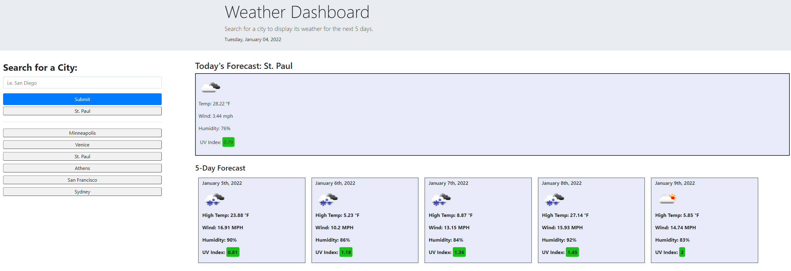

# 06 Server-Side APIs: Weather Dashboard

Welcome to the [Weather Dashboard project](./index.html)! Here you can search for a city to see its current weather, as well as a five-day forecast.

## Features

### City Lookup
You can query any city in the world to see its weather. Hypothetically, you'd also be able to click items from your history to search for that city again, but that feature is kicking my ass right now and defeated my entire study group and BCS help tutor. (It works fine for buttons that are hard-coded, but that's not terribly helpful for us.)

### Weather Data
Each query will return two sets of information: current conditions, and a 5-day forecast.
* An image displaying cloud cover and precipitation.
* Temperature. Default returns in degrees Farenheit. (Current temperature for today; high temperature for forecast.)
* Wind speed.
* % humidity.
* UV index.

UV Index will also display with a color block to indicate low, moderate, or high levels of risk.

## Under the Hood

### API
The application uses fetch to query the openweathermap API. It first queries openweathermap, then uses the returned coordinates to fetch openweather OneCall.

### Local Storage
Cities queried will be stored in local storage and populated when a query is submitted or when the page is reloaded. A stretch goal would be to add a button to manually clear the history, or to start clipping the list once it goes over a certain length.

### Validation
To prevent messy states, the app will validate city entries. First, it will check that the city was recognized and return an error if not. Then it will check the city entry against the list of currently displayed cities so as not to create redundant entries.

### Modability
There are several variables that can be tweaked to customize the experience. 
* The number of returned days in the forecast can be tweaked. (This will require retooling of the CSS to get them to display nicely.)
* The temperature can be changed to display in Celcius or Kalvin (as per the openweather API's parameters).
